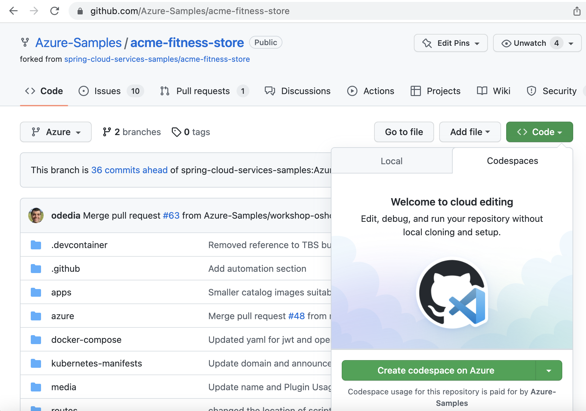

In this section you are going complete the following pre-requisites
 - Setting an Azure account with Enterprise Subscription
 - Access Github Codespaces
 - Set the env variables
 - Log into az cli and accept Enterprise license
  
## Azure Account
To start the workshop, you need to have an Azure account with active subscription. If you already have an enterprise account from your company, you can skip this section and move on to the next one. 

If you are proceeding with creating an account, please sign-up for a free Azure Pass account which gives you 200$ worth of free credit per month. Free account can be created by visiting [azure pass](https://www.microsoftazurepass.com/)

As part of the workshop you will be provided a Promo Code which gives 200$ worth of free credits for one month. Please make sure you enter the Promo Code when you sign up for the new Azure account. After the account is created, you can check the balance of your Azure Pass Credits on https://www.microsoftazuresponsorships.com/balance

Once the account is created, please forward your subscription id to the workshop moderator. They will ensure the background processing is completed for you to go ahead and start using the subscription.

Subscription id can be accessed as below

Login to portal.azure.com
In the search bar, type the keyword Subscriptions. This should pull up your subscription
Click on the subscription link that shows up in the search results
On the result page you will find the Subscription Id.

## Github Codespaces
To run cli commands in this workshop we need to have access to a terminal that has the required software installed. As the workshop participants has diverse environments, instead of spending time figuring out nuance of different environments and how to make them work with asa-e,for this workshop we are going to use the Codespaces feature offered by Github. This comes with VSCode and an integrated terminal that has all the required software with appropriate versions to run the workshop.

The requirement to get Codespaces enabled for you is to get your gitid added to github.com/Azure-Samples. From your side, you need to provide your github id to the workshop facilitator and they will do the needful to enable Codespaces for your git account. Once the workshop facilitator adds you to the github org, you will receive an invitation to join the Org. After you accept the invitation, you should see Codespaces option enabled. Below screenshot shows a sample of Codespaces enabled.



### Set the env vars
Run the below command
```shell
cp ./env/env-vars-template.sh ./env/env-vars.sh
```

Update the variable names based on the comments.

Run this command
```shell
./scripts/1.1-set-env-vars.sh
```

### Login to Azure

Login to the Azure CLI and choose your active subscription. In the terminal of VS Code in Codespace, run the below commands

```shell
./scripts/1.2-cli-login.sh
```

Accept the legal terms and privacy statements for the Enterprise tier.

> Note: This step is necessary only if your subscription has never been used to create an Enterprise tier instance of Azure Spring Apps.

```shell
./scripts/1.3-accept-license.sh
```

⬅️ Previous guide: [Main Guide](../README.md)

➡️ Next guide: [02 - Create Resource Group](../02-create-resource-group/README.md)

