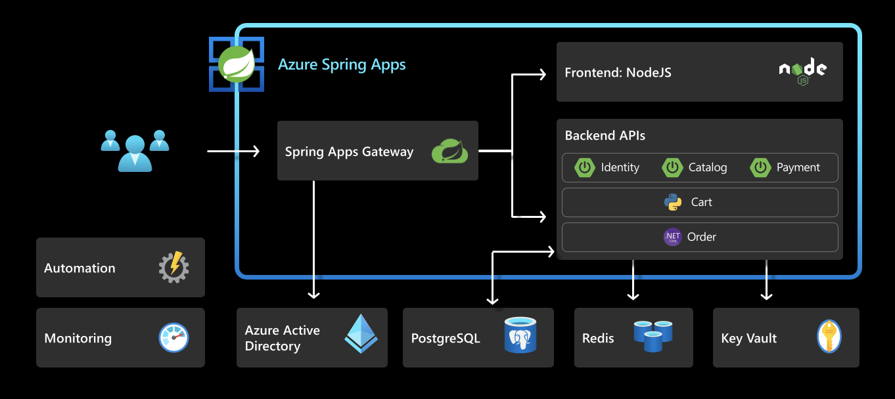

This section discusses the demo application that we will be using in this workshop to demonstrate the different features of ASA-E.

Below image shows the services involved in the ACME Fitness Store. It depicts the applications and their dependencies on different ASA-E services. We will be implementing this architecture by the end of this workshop.

This application is composed of several services:

* 3 Java Spring Boot applications:
  * A catalog service for fetching available products
  * A payment service for processing and approving payments for users' orders
  * An identity service for referencing the authenticated user

* 1 Python application:
  * A cart service for managing a users' items that have been selected for purchase

* 1 ASP.NET Core applications:
  * An order service for placing orders to buy products that are in the users' carts

* 1 NodeJS and static HTML Application
  * A frontend shopping application

As you see from the above overview, in addition to the above services there are other dependent ASA-E services also as below
 - Spring Cloud Gateway
 - Azure Active Directory
 - Azure Postgres 
 - Azure Cache for Redis
 - Azure Key Vault
 - Azure services for Monitoring and Logging

The next section will introduce these services, their usage in this architecture. Following sections will discuss how they can be configured. 

⬅️ Previous guide: [05 - Deploy Simple Hello World spring boot app](../05-hol-1-hello-world-app/README.md)

➡️ Next guide: [07 - ASA-E components Overview](../07-asa-e-components-overview/README.md)