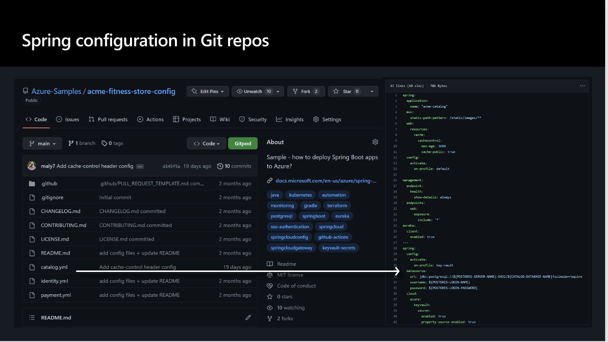
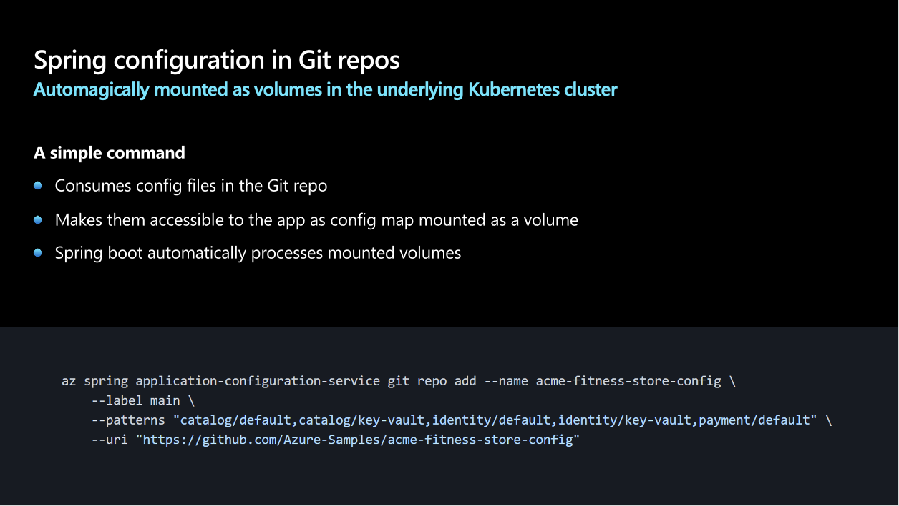

Spring Apps application applications typically externalize their configuration into git repository and access the configurations using Spring Apps config server and associated client libraries as show below.

The Application configuration service is a feature of azure spring apps enterprise that makes Spring Apps config server capabilities available in a polyglot way.
Application configuration service works by pulling configuration settings from a git repo and turning them into Kubernetes config maps that are then mounted as volume in the running container. Spring Boot knows how to read the contents of the configuration settings automatically.

There are two benefits to the application configuration service
 - First you can remove the Spring Apps config server jars from the applications classpath
 - Second if you have a non spring based app that you are deploying you can easily access its configuration without needing a custom library in the specific programming language.
