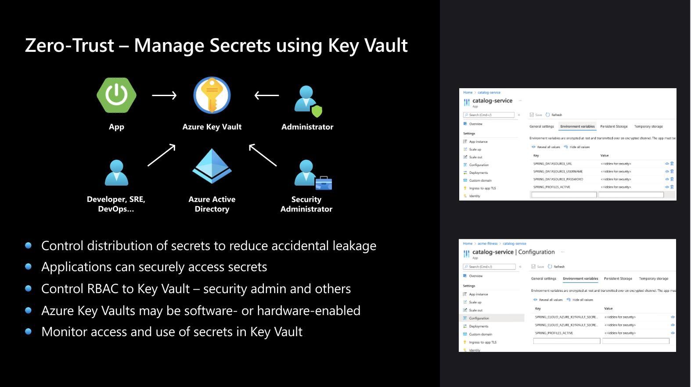

In the above diagram we have two examples of the “backend” app.

Every application has properties that connect it to its environment and supporting services, things like databases, logging and monitoring tools, messaging platforms, and many other things. Each requires a way to locate and access it, often in the form of URLs and credentials...and if exposed, that critical information can be used to access key customer data. Even if this data weren't protected by law – and it is in nearly all parts of the globe, for a very good reason – protecting customer data from leakage should still be of utmost importance to all of us.
Since applications need that information to operate, the first step app developers usually take is to embed it within the app itself. This is a huge security risk, for many reasons, not the least of which is that it is nearly inevitable that it will eventually slip through and be committed to a code repository, making it prone to discovery.

To increase application scalability, app devs typically move on to externalizing key data values and credentials so that multiple instances of the same application can load the same values, dynamically refreshing when they are updated. This only shifts the risk from the code to the execution environment. In the left portion of the screen is an example of the customers service that uses environment variables for key credentials.

Azure Key Vault provides a better, safer, and much more secure way to manage secrets. With Azure Key Vault:
You control storage and distribution of application secrets to reduce accidental leakage
Applications can securely access credentials
Key Vault uses Role Based Access Control (RBAC) to lock down access to only those requiring access: admins of course, but also apps, using the principle of least privilege
Authentication and Authorization use Azure Active Directory and Azure RBAC
Azure Key Vaults may be software- or hardware-protected
And of course, you can monitor the access and use of secrets in Key Vault, with a full audit trail.