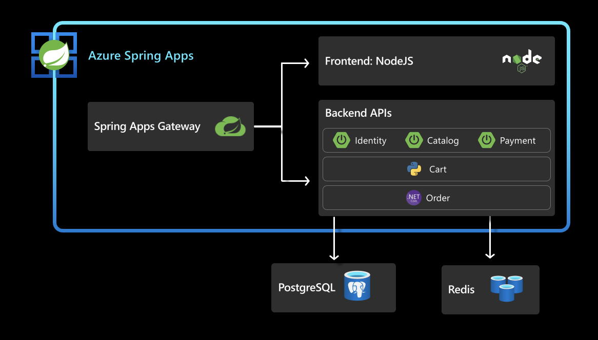

This unit will create persistent stores (postgres, Azure Cache for Redis) outside the applications and connect applications to those stores. The arm template that was eexcuted in [03-workshop-environment-setup](../03-workshop-environment-setup/acmedeploy.json) created the Postgres Server instance and Azure Cache for Redis instance.

Once this section is complete, the architecture looks as below:
 

## 1. Prepare your environment

Create a bash script with environment variables by making a copy of the supplied template:

```shell
cp ./scripts/setup-db-env-variables-template.sh ./scripts/setup-db-env-variables.sh
```

Open `./scripts/setup-db-env-variables.sh` and enter the following information:

```shell
export AZURE_CACHE_NAME=acme-fitness-cache-CHANGE-ME                 #Unique name for Azure Cache for Redis Instance. Replace CHANGE_ME with the 4 unique characters that were created as part of ARM template in Section 3. [workshop-environment-setup](../03-workshop-environment-setup/README.md)
export POSTGRES_SERVER=acme-fitness-db-CHANGE-ME                 # Unique name for Azure Database for PostgreSQL Flexible Server. Replace CHANGE_ME with the 4 unique characters that were created as part of ARM template in Section 3.
```

The values for the above variables can be looked up by going to your Resource Group that was created as part of ARM template. That should list all the resources that are part of that resource group and the entries for database and cache will be visible there.

Then, set the environment:

```shell
source ./scripts/setup-db-env-variables.sh
```


### 1.1. Allow connections from other Azure Services
```shell
az postgres flexible-server firewall-rule create --rule-name allAzureIPs \
     --name ${POSTGRES_SERVER} \
     --resource-group ${RESOURCE_GROUP} \
     --start-ip-address 0.0.0.0 --end-ip-address 0.0.0.0
     
### Enable the uuid-ossp extension
az postgres flexible-server parameter set \
    --resource-group ${RESOURCE_GROUP} \
    --server-name ${POSTGRES_SERVER} \
    --name azure.extensions --value uuid-ossp
```

## 2. Create a database for the services:

Create a database for the order service:

```shell
az postgres flexible-server db create \
  --database-name ${ORDER_SERVICE_DB} \
  --server-name ${POSTGRES_SERVER}
```

Create a database for the catalog service:

```shell
az postgres flexible-server db create \
  --database-name ${CATALOG_SERVICE_DB} \
  --server-name ${POSTGRES_SERVER}
```

> Note: wait for all services to be ready before continuing

## 3. Create Service Connectors

The Order Service and Catalog Service use Azure Database for Postgres, create Service Connectors for those applications:

```shell
# Bind order service to Postgres
az spring connection create postgres-flexible \
    --resource-group ${RESOURCE_GROUP} \
    --service ${SPRING_APPS_SERVICE} \
    --connection ${ORDER_SERVICE_DB_CONNECTION} \
    --app ${ORDER_SERVICE_APP} \
    --deployment default \
    --tg ${RESOURCE_GROUP} \
    --server ${POSTGRES_SERVER} \
    --database ${ORDER_SERVICE_DB} \
    --secret name=${POSTGRES_SERVER_USER} secret=${POSTGRES_SERVER_PASSWORD} \
    --client-type dotnet
    

# Bind catalog service to Postgres
az spring connection create postgres-flexible \
    --resource-group ${RESOURCE_GROUP} \
    --service ${SPRING_APPS_SERVICE} \
    --connection ${CATALOG_SERVICE_DB_CONNECTION} \
    --app ${CATALOG_SERVICE_APP} \
    --deployment default \
    --tg ${RESOURCE_GROUP} \
    --server ${POSTGRES_SERVER} \
    --database ${CATALOG_SERVICE_DB} \
    --secret name=${POSTGRES_SERVER_USER} secret=${POSTGRES_SERVER_PASSWORD} \
    --client-type springboot
```

The Cart Service requires a connection to Azure Cache for Redis, create the Service Connector:

```shell
az spring connection create redis \
    --resource-group ${RESOURCE_GROUP} \
    --service ${SPRING_APPS_SERVICE} \
    --connection $CART_SERVICE_CACHE_CONNECTION \
    --app ${CART_SERVICE_APP} \
    --deployment default \
    --tg ${RESOURCE_GROUP} \
    --server ${AZURE_CACHE_NAME} \
    --database 0 \
    --client-type java 
```

> Note: Currently, the Azure Spring Apps CLI extension only allows for client types of java, springboot, or dotnet.
> The cart service uses a client connection type of java because the connection strings are the same for python and java.
> This will be changed when additional options become available in the CLI.

## 4. Update Applications

Next, update the affected applications to use the newly created databases and redis cache.

Restart the Catalog Service for the Service Connector to take effect:
```shell
az spring app restart --name ${CATALOG_SERVICE_APP}
```

Retrieve the PostgreSQL connection string and update the Order Service:
```shell
POSTGRES_CONNECTION_STR=$(az spring connection show \
    --resource-group ${RESOURCE_GROUP} \
    --service ${SPRING_APPS_SERVICE} \
    --deployment default \
    --connection ${ORDER_SERVICE_DB_CONNECTION} \
    --app ${ORDER_SERVICE_APP} | jq '.configurations[0].value' -r)

az spring app update \
    --name order-service \
    --env "DatabaseProvider=Postgres" "ConnectionStrings__OrderContext=${POSTGRES_CONNECTION_STR}" "AcmeServiceSettings__AuthUrl=https://${GATEWAY_URL}"
```

Retrieve the Redis connection string and update the Cart Service:
```shell
REDIS_CONN_STR=$(az spring connection show \
    --resource-group ${RESOURCE_GROUP} \
    --service ${SPRING_APPS_SERVICE} \
    --deployment default \
    --app ${CART_SERVICE_APP} \
    --connection ${CART_SERVICE_CACHE_CONNECTION} | jq -r '.configurations[0].value')

az spring app update \
    --name cart-service \
    --env "CART_PORT=8080" "REDIS_CONNECTIONSTRING=${REDIS_CONN_STR}" "AUTH_URL=https://${GATEWAY_URL}"
```

## 5. View Persisted Data

Verify order data is now persisted in a PostgreSQL Database by placing an order. View your placed orders with the following URL:

```text
echo https://${GATEWAY_URL}/order/${USER_ID}
```

Your USER_ID is your username as a URL encoded string. For example: John Smith is John%20Smith.

Now restart the order service application:

```shell
az spring app restart --name ${ORDER_SERVICE_APP}
```


⬅️ Previous guide: [10 - Hands On Lab 3.2 - Bind Apps to ACS and Service Registry](../10-hol-3.2-bind-apps-to-acs-service-reg/README.md)

➡️ Next guide: [12 - Hands On Lab 3.4 Configure Single Sign On](../12-hol-3.4-configure-single-signon/README.md)