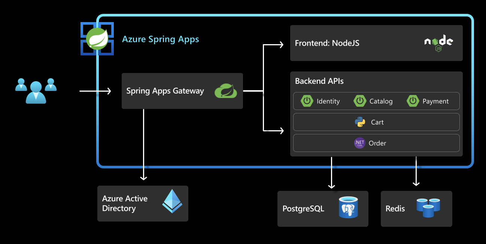

In this Unit, you will configure Single Sign-On for Spring Cloud Gateway using Azure Active Directory or an existing Identity Provider.

Once this section is complete, the architecture looks as below:
 

## 1. Register Application with Azure AD

Choose a unique display name for your Application Registration.

```shell
export AD_DISPLAY_NAME=acme-ad-YOUR-UNIQUE_USERNAME    # unique application display name
```

Create an Application registration with Azure AD and save the output.

```shell
az ad app create --display-name ${AD_DISPLAY_NAME} > ad.json
```

Retrieve the Application ID and collect the client secret:

```shell
export APPLICATION_ID=$(cat ad.json | jq -r '.appId')

az ad app credential reset --id ${APPLICATION_ID} --append > sso.json
```

Add the necessary web redirect URIs to the Azure AD Application Registration:

```shell
az ad app update --id ${APPLICATION_ID} \
    --web-redirect-uris "https://${GATEWAY_URL}/login/oauth2/code/sso" \
     "https://${PORTAL_URL}/oauth2-redirect.html" "https://${PORTAL_URL}/login/oauth2/code/sso"
```

Detailed information about redirect URIs can be found [here](https://docs.microsoft.com/en-us/azure/active-directory/develop/quickstart-register-app#add-a-redirect-uri).

Assign a Service Principal to the Application Registration

```shell
az ad sp create --id ${APPLICATION_ID}
```

More detailed instructions on Application Registrations can be found [here](https://docs.microsoft.com/en-us/azure/active-directory/develop/quickstart-register-app)

### 1.1. Prepare your environment for SSO Deployments

Set the environment using the provided script and verify the environment variables are set:

```shell
source ./scripts/setup-sso-variables-ad.sh

echo ${CLIENT_ID}
echo ${CLIENT_SECRET}
echo ${TENANT_ID}
echo ${ISSUER_URI}
echo ${JWK_SET_URI}
```

The `ISSUER_URI` should take the form `https://login.microsoftonline.com/${TENANT_ID}/v2.0`
The `JWK_SET_URI` should take the form `https://login.microsoftonline.com/${TENANT_ID}/discovery/v2.0/keys`

## 2. Create and Deploy the Identity Service Application

Create the identity service application

```shell
az spring app create --name ${IDENTITY_SERVICE_APP} --instance-count 1 --memory 1Gi
```

Bind the identity service to Application Configuration Service

```shell
az spring application-configuration-service bind --app ${IDENTITY_SERVICE_APP}
```

Bind the identity service to Service Registry.

```shell
az spring service-registry bind --app ${IDENTITY_SERVICE_APP}
```

Create routing rules for the identity service application in SCG

```shell
az spring gateway route-config create \
    --name ${IDENTITY_SERVICE_APP} \
    --app-name ${IDENTITY_SERVICE_APP} \
    --routes-file ./routes/identity-service.json
```

### 2.1. Deploy the Identity Service:

```shell
az spring app deploy --name ${IDENTITY_SERVICE_APP} \
    --env "JWK_URI=${JWK_SET_URI}" \
    --config-file-pattern identity/default \
    --source-path ./apps/acme-identity
```

> Note: The application will take around 3-5 minutes to deploy.

## 3. Configure Spring Cloud Gateway with SSO

Configure Spring Cloud Gateway with SSO enabled:

```shell
az spring gateway update \
    --client-id ${CLIENT_ID} \
    --client-secret ${CLIENT_SECRET} \
    --scope ${SCOPE} \
    --issuer-uri ${ISSUER_URI} \
    --no-wait
```

### 3.1. Update Existing Applications

Update the existing applications to use authorization information from Spring Cloud Gateway:

```shell
# Update the Cart Service
az spring app update --name ${CART_SERVICE_APP} \
    --env "AUTH_URL=https://${GATEWAY_URL}" "CART_PORT=8080" 
    
# Update the Order Service
az spring app  update --name ${ORDER_SERVICE_APP} \
    --env "AcmeServiceSettings__AuthUrl=https://${GATEWAY_URL}" 
```

### 3.2. Login to the Application through Spring Cloud Gateway

Retrieve the URL for Spring Cloud Gateway and open it in a browser:

```shell
echo "https://${GATEWAY_URL}"
```

You should see the ACME Fitness Store Application, and be able to log in using your
SSO Credentials. Once logged in, the remaining functionality of the application will
be available. This includes adding items to the cart and placing an order.

## 4. Configure SSO for API Portal

Configure API Portal with SSO enabled:

```shell
export PORTAL_URL=$(az spring api-portal show | jq -r '.properties.url')

az spring api-portal update \
    --client-id ${CLIENT_ID} \
    --client-secret ${CLIENT_SECRET}\
    --scope "openid,profile,email" \
    --issuer-uri ${ISSUER_URI}
```

### 4.1. Explore the API using API Portal

Open API Portal in a browser, this will redirect you to log in now:

```shell
echo "https://${PORTAL_URL}"
```

To access the protected APIs, click Authorize and follow the steps that match your
SSO provider. Learn more about API Authorization with API Portal [here](https://docs.vmware.com/en/API-portal-for-VMware-Tanzu/1.0/api-portal/GUID-api-viewer.html#api-authorization)

## 5. Testing the app

At this point, you are all ready to start testing the app and place orders. 

⬅️ Previous guide: [11 - Hands On Lab 3.3 - Configure Database and Cache](../11-hol-3.3-configure-database-cache/README.md)

➡️ Next guide: [13 - Hands On Lab 3.5 - Configure Azure KeyVault](../13-hol-3.5-configure-azure-keyvault/README.md)