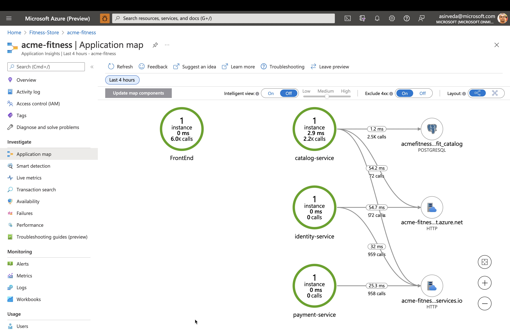
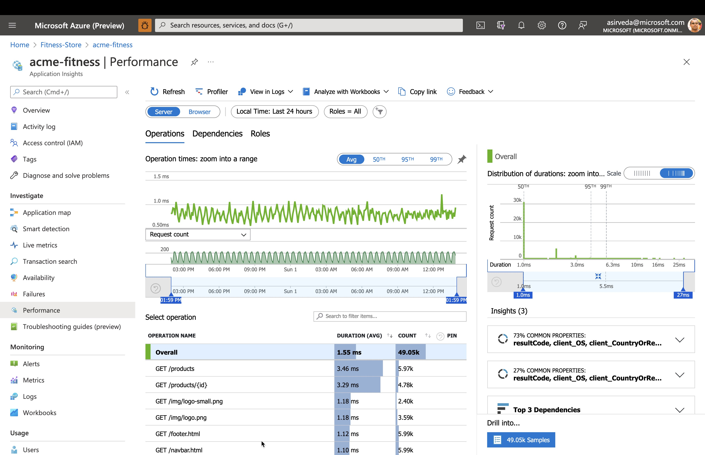
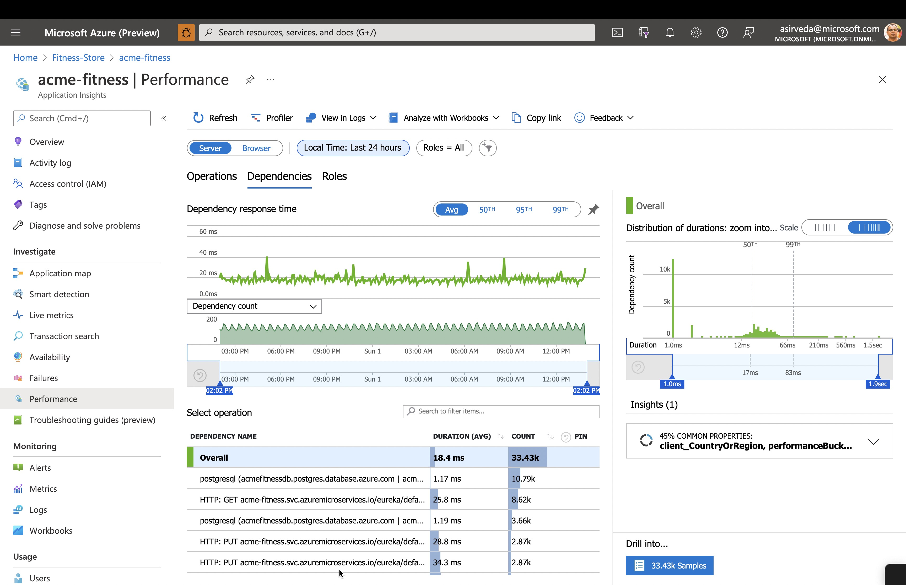
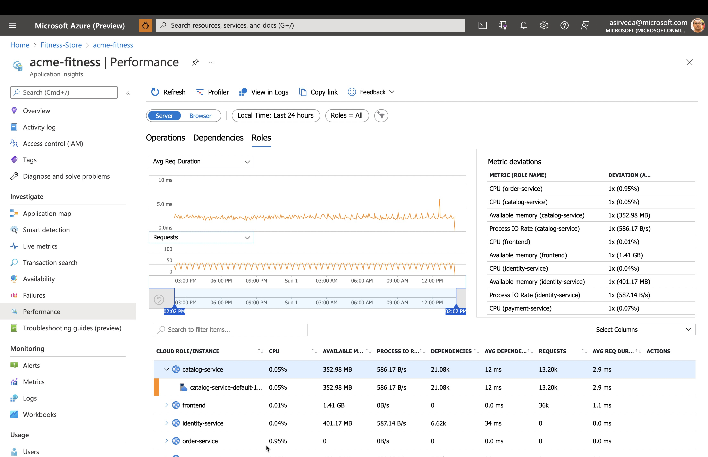
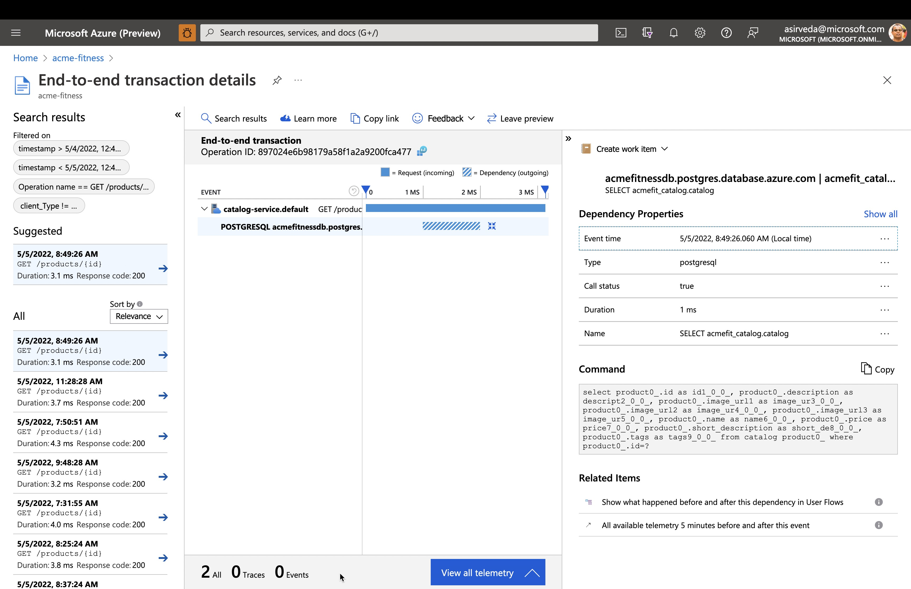
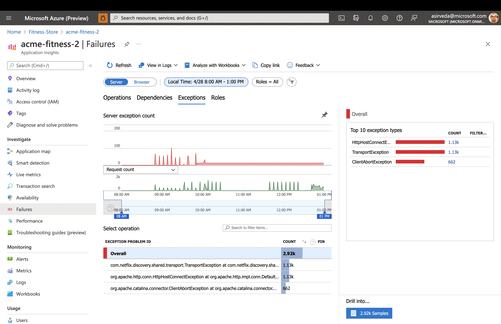
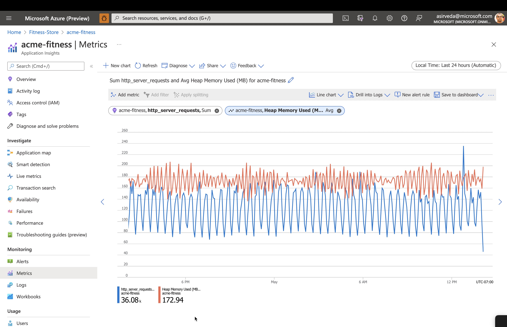
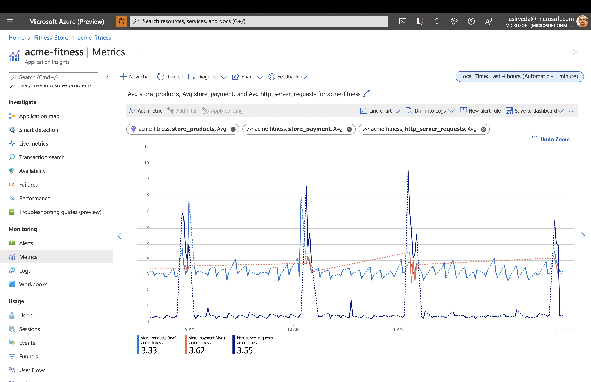
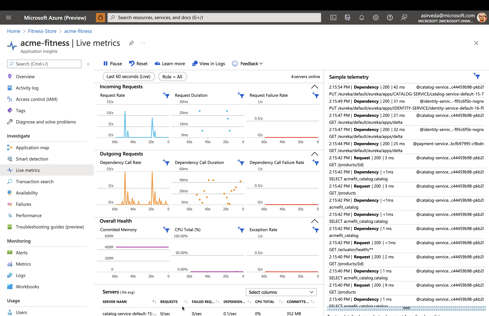

In this unit you will explore live application metrics and query logs to know the health of your applications.

### Add Instrumentation Key to Key Vault

The Application Insights Instrumentation Key must be provided for the non-java applications.

> Note: In future iterations, the buildpacks for non-java applications will support
> Application Insights binding and this step will be unnecessary.

### Generate Traffic

Use the ACME Fitness Shop Application to generate some traffic. Move throughout the application, view the catalog, or place an order.

To continuously generate traffic, use the traffic generator:

```shell
cd traffic-generator
GATEWAY_URL=https://${GATEWAY_URL} ./gradlew gatlingRun-com.vmware.acme.simulation.GuestSimulation
cd -
```

Continue on to the next sections while the traffic generator runs.

### Start monitoring apps and dependencies - in Application Insights

Open the Application Insights created by Azure Spring Apps and start monitoring Spring Boot applications. 
You can find the Application Insights in the same Resource Group where you created an Azure Spring Apps service instance.

Navigate to the `Application Map` blade:



Navigate to the `Performance` blade:



Navigate to the `Performance/Dependenices` blade - you can see the performance number for dependencies,
particularly SQL calls:



Navigate to the `Performance/Roles` blade - you can see the performance metrics for individual instances or roles:



Click on a SQL call to see the end-to-end transaction in context:



Navigate to the `Failures` blade and the `Exceptions` panel - you can see a collection of exceptions:



Navigate to the `Metrics` blade - you can see metrics contributed by Spring Boot apps,
Spring Cloud modules, and dependencies.
The chart below shows `http_server_requests` and `Heap Memory Used`.



Spring Boot registers a lot number of core metrics: JVM, CPU, Tomcat, Logback...
The Spring Boot auto-configuration enables the instrumentation of requests handled by Spring MVC.
The REST controllers `ProductController`, and `PaymentController` have been instrumented by the `@Timed` Micrometer annotation at class level.

* `acme-catalog` application has the following custom metrics enabled:
  * @Timed: `store.products`
* `acem-payment` application has the following custom metrics enabled:
  * @Timed: `store.payment`

You can see these custom metrics in the `Metrics` blade:



Navigate to the `Live Metrics` blade - you can see live metrics on screen with low latencies < 1 second:



⬅️ Previous guide: [13 - Hands On Lab 3.5 - Configure Azure Key Vault](../13-hol-3.5-configure-azure-keyvault/README.md)

➡️ Next guide: [15 - Hands On Lab 4.2 - Logging](../15-hol-4.2-logging/README.md)