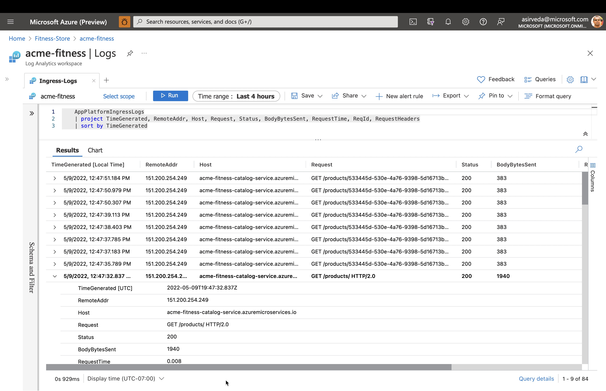
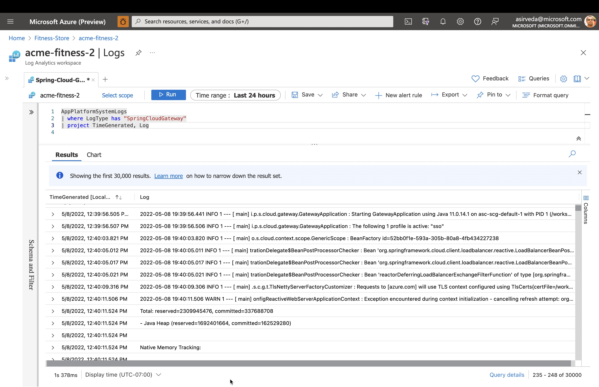

### Get the log stream for an Application

Use the following command to get the latest 100 lines of app console logs from the Catalog Service.

```shell
az spring app logs \
    -n ${CATALOG_SERVICE_APP} \
    --lines 100
```

By adding the `-f` parameter you can get real-time log streaming from an app. Try log streaming for the Catalog Service.

```shell
az spring app logs \
    -n ${CATALOG_SERVICE_APP} \
    -f
```

You can use `az spring app logs -h` to explore more parameters and log stream functionalities.


### Start monitoring ACME Fitness Store's logs and metrics in Azure Log Analytics

Open the Log Analytics that you created - you can find the Log Analytics in the same
Resource Group where you created an Azure Spring Apps service instance.

In the Log Analytics page, selects `Logs` blade and run any of the sample queries supplied below
for Azure Spring Apps.

Type and run the following Kusto query to see application logs:

```sql
    AppPlatformLogsforSpring 
    | where TimeGenerated > ago(24h) 
    | limit 500
    | sort by TimeGenerated
    | project TimeGenerated, AppName, Log
```


Type and run the following Kusto query to see `catalog-service` application logs:

```sql
    AppPlatformLogsforSpring 
    | where AppName has "catalog-service"
    | limit 500
    | sort by TimeGenerated
    | project TimeGenerated, AppName, Log
```


Type and run the following Kusto query to see errors and exceptions thrown by each app:
```sql
    AppPlatformLogsforSpring 
    | where Log contains "error" or Log contains "exception"
    | extend FullAppName = strcat(ServiceName, "/", AppName)
    | summarize count_per_app = count() by FullAppName, ServiceName, AppName, _ResourceId
    | sort by count_per_app desc 
    | render piechart
```



Type and run the following Kusto query to see all in the inbound calls into Azure Spring Apps:

```sql
    AppPlatformIngressLogs
    | project TimeGenerated, RemoteAddr, Host, Request, Status, BodyBytesSent, RequestTime, ReqId, RequestHeaders
    | sort by TimeGenerated
```

Type and run the following Kusto query to see all the logs from Spring Cloud Gateway managed by Azure Spring Apps:

```sql
    AppPlatformSystemLogs
    | where LogType contains "SpringCloudGateway"
    | project TimeGenerated,Log
```



Type and run the following Kusto query to see all the logs from Spring Cloud Service Registry managed by Azure Spring Apps:

```sql
    AppPlatformSystemLogs
    | where LogType contains "ServiceRegistry"
    | project TimeGenerated, Log
```


⬅️ Previous guide: [14 - Hands On Lab 4.1 - End-End Observability](../14-hol-4.1-end-to-end-observability/README.md)

➡️ Next guide: [16 - Conclusion](../16-Conclusion/README.md)