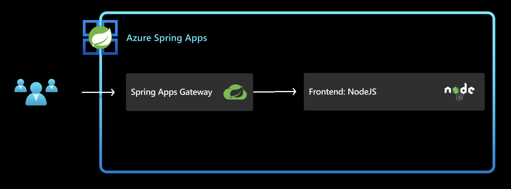

In the previous section we deployed a simple hello-world service to asa-e instance. In this section we are going to deploy the frontend of acme-fitness, configure that with Spring Cloud Gateway and validate that we are able to access the frontend. 

This diagram below shows the final result once this section is complete:


Below are the diffrent steps that we configure/create to successfully deploy the services/apps
- [1. Create and Deploy frontend application in Azure Spring Apps](#1-create-and-deploy-frontend-application-in-azure-spring-apps)
- [4. Configure Spring Cloud Gateway](#4-configure-spring-cloud-gateway)
  - [4.1. Create  routing rules for the applications:](#41-create--routing-rules-for-the-applications)
- [5. Access the Application through Spring Cloud Gateway](#5-access-the-application-through-spring-cloud-gateway)


## 1. Create and Deploy frontend application in Azure Spring Apps

First step is to create an application for each service:


```shell
az spring app create --name ${FRONTEND_APP} --instance-count 1 --memory 1Gi &
wait
```

Once the above step is complete, we need to deploy the app.
```shell
az spring app deploy --name ${FRONTEND_APP} \
    --source-path ./apps/acme-shopping 
```

## 4. Configure Spring Cloud Gateway

Assign a public endpoint and update the Spring Cloud Gateway configuration with API
information:

```shell
az spring gateway update --assign-endpoint true
export GATEWAY_URL=$(az spring gateway show | jq -r '.properties.url')
```
The assign-endpoint argument with a value of true creates a publicly accessible endpoint for the gateway.

```shell
az spring gateway update \
    --api-description "Acme Fitness Store API" \
    --api-title "Acme Fitness Store" \
    --api-version "v1.0" \
    --server-url "https://${GATEWAY_URL}" \
    --allowed-origins "*" \
    --no-wait
```

### 4.1. Create  routing rules for the applications:

Routing rules bind endpoints in the request to the backend applications. In the step below we are creating a rule in SCG to the frontend app.

```shell

az spring gateway route-config create \
    --name ${FRONTEND_APP} \
    --app-name ${FRONTEND_APP} \
    --routes-file ./routes/frontend.json

```

## 5. Access the Application through Spring Cloud Gateway

Retrieve the URL for Spring Cloud Gateway and open it in a browser:

```shell
echo "https://${GATEWAY_URL}"
```

If you see acme-fitness home page displayed as below, then congratulations. Your frontend app and its corresponding route in SCG are configured correctly and deployed successfully. Explore the application, but notice that not everything is functioning yet. Continue on to next section to configure the rest of the functionality.


⬅️ Previous guide: [02 - HOL 1- Deploy Hello World app](../01-workshop-environment-setup/README.md)

➡️ Next guide: [04 - Hands On Lab 3 - Deploy backend apps](../04-hol-3-deploy-backend-apps/README.md)