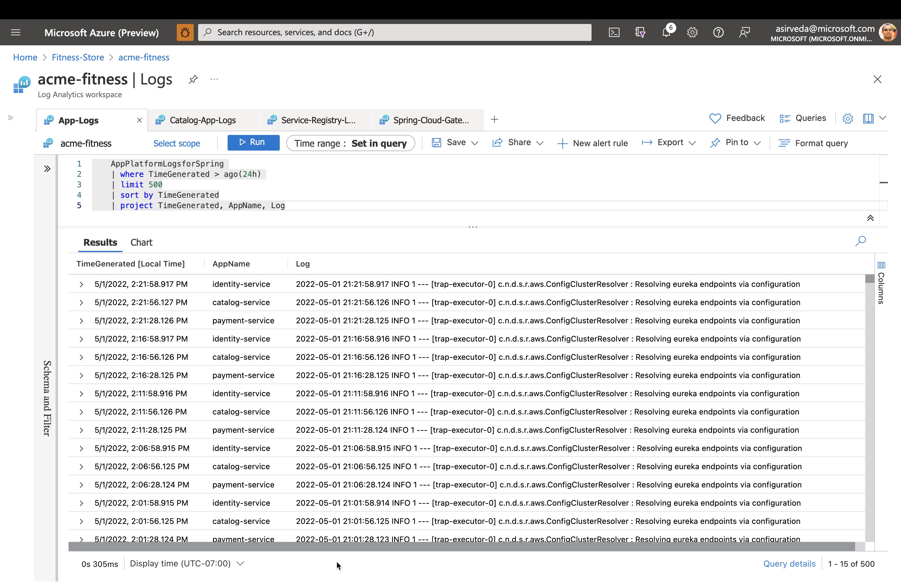
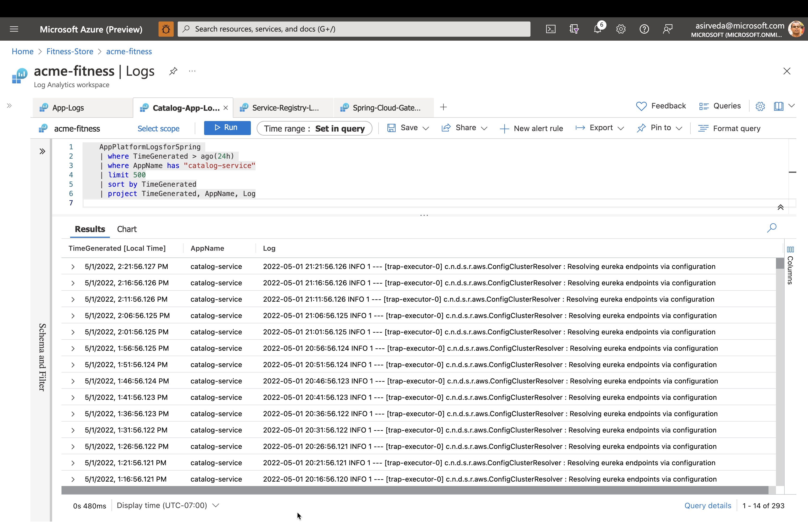
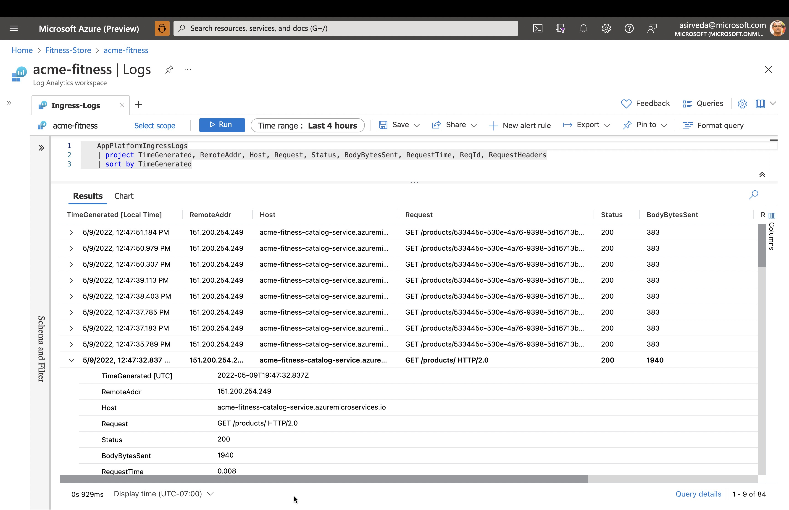
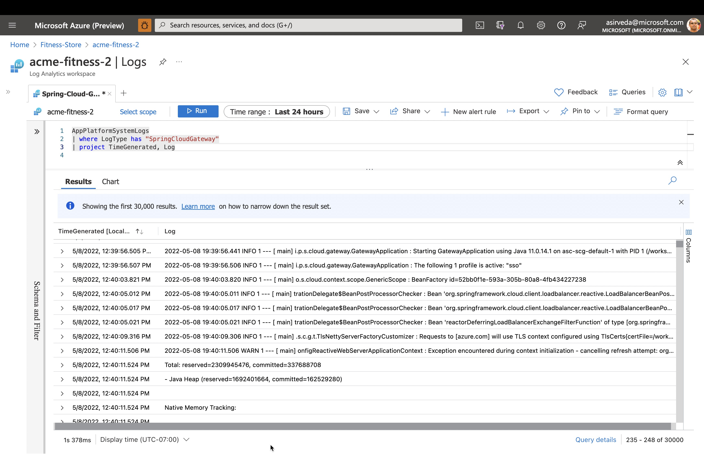
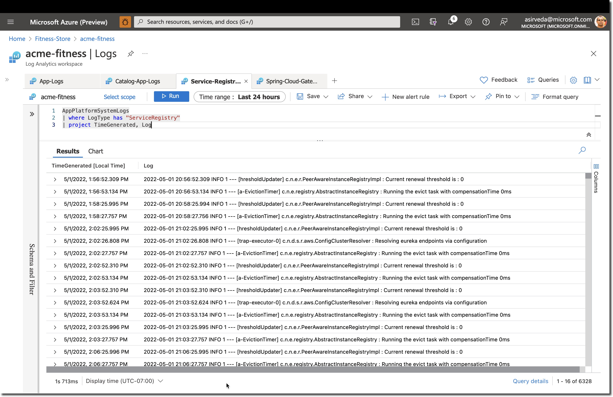

This is an optional exercise for the students. 

In the Spring Apps Instance, scroll down on the left blade till you see the Logs section. 

Type and run the following Kusto query to see application logs:

```sql
    AppPlatformLogsforSpring 
    | where TimeGenerated > ago(24h) 
    | limit 500
    | sort by TimeGenerated
    | project TimeGenerated, AppName, Log
```



Type and run the following Kusto query to see `catalog-service` application logs:

```sql
    AppPlatformLogsforSpring 
    | where AppName has "catalog-service"
    | limit 500
    | sort by TimeGenerated
    | project TimeGenerated, AppName, Log
```



Type and run the following Kusto query to see errors and exceptions thrown by each app:
```sql
    AppPlatformLogsforSpring 
    | where Log contains "error" or Log contains "exception"
    | extend FullAppName = strcat(ServiceName, "/", AppName)
    | summarize count_per_app = count() by FullAppName, ServiceName, AppName, _ResourceId
    | sort by count_per_app desc 
    | render piechart
```



Type and run the following Kusto query to see all in the inbound calls into Azure Spring Apps:

```sql
    AppPlatformIngressLogs
    | project TimeGenerated, RemoteAddr, Host, Request, Status, BodyBytesSent, RequestTime, ReqId, RequestHeaders
    | sort by TimeGenerated
```

Type and run the following Kusto query to see all the logs from Spring Cloud Gateway managed by Azure Spring Apps:

```sql
    AppPlatformSystemLogs
    | where LogType contains "SpringCloudGateway"
    | project TimeGenerated,Log
```



Type and run the following Kusto query to see all the logs from Spring Cloud Service Registry managed by Azure Spring Apps:

```sql
    AppPlatformSystemLogs
    | where LogType contains "ServiceRegistry"
    | project TimeGenerated, Log
```




⬅️ Previous guide: [04 - Hands On Lab 3 - Deploy backend apps](../04-hol-3-deploy-backend-apps/README.md)

➡️ Workshop Start: [01 - Workshop Environment Setup](../01-workshop-environment-setup/README.md)